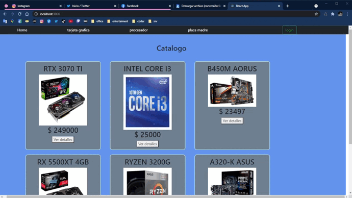

# Mi app

## Creacion:
    npx create-react-app mi-app
## Inicializar:
    npm start

## **Componentes**

## context:

**cartContext funciones**

addItem: agregar productos al carrito y verificar que no esten repetidos.

isInCar: buscar el producto dentro del carrito returna true o false.

removeItem: recibe por props un id y setea al carrito un array filtrado.

clear: vacia el carrito.

getTotal: recorre el carrito, calcula y retorna el total.

getQuantity: recorre el carrito, cuenta y retorna las cantidades

**userContext funciones:**

login: recibe el nombre de osuario y lo guarda en un estado

logout: vacia el estado

## firebase:

Utilizo firebase.js para traer documentacion de la base de datos y exportarla a los componentes de mi-app 

funciones que exporta:

categorias: retorna una promesa con todas las categorias de la base de datos

getArticles: recibe tres props, si las tres son verdaderas retorna una promesa con los productos filtrados, si no lo son retorna todos los productos.

articleById: recibe por props un id y busca en la base de datos y retorna un solo articulo.

sendOrder: recibe un objeto por props, revisa si hay stock disponible para todos los objetos pedidos, si no hay los pushea a un array, luego si el array esta vacio agrega los pedidos a la base de datos. y retorna una promesa de succes o error

## navBar:
Utilezo la funcion categorias() la cual retorna una promise con las categorias las cuales guarde en un estado "category" y las mapie dentro del navBar.

Importo las funciones logout() y user() del context userContext y linkeo el login para iniciar sesion.
Tambien importo getQuantity() y clear() del context carContext para agregar la cantidad al carrito y para vaciar el carrito cuando se cierra sesion.

## cart:

recibe las funciones clear(), getTotal() y articulos del [cartContext]() y user() del [userContext](), mapea los articulos por props en el itemCart donde los muestra.
Retorna los articulos y los botones vaciar carrito, confirmar compra(pasa por props el carrito y recibe una promesa) y el total

## itemCount:

recibe addItem(), isInCar(),getProduct() del [cartContext](). Luego dentro de un useEffect utilizo la funcion isIncar() y si es verdadero tambien getProduct() para setear la cantidad a un estado. Luego retorno la cantidad del estado y los botones para agregar (sin pasarme del stock que recibi por props),restar , y el boton agregar al carrito que ejecuta la funcion addItem.

## itemListContainer:

importo itemList, useEffect, useState, useParams y getArticles del firebase. Creo un estado de articulos el cual seteo dentro de un useEffect. el useEffect cambia cuando recibe un id y se lo envia por props a getArticles() el cual retorna una promesa.

Luego de envian por props los articulos al componente itemList.

## itemList:

importo el componente item, luego mapeo los articulos recibidos por props al componente item

## item:

importo item.css y Link de react-router-dom. retorno una card con los detalles que recibo por props y utilizo link para que al clickear el boton "ver detalles" te envie al componente itemDetail

## itemDetailContainer:

Recibo un id por useParams. Utilizo articlebyId con el id dentro del useEffect y que actualize cada que cambia el id, agrego el articulo a un estado y lo mando por props al componente itemDetail

itemDetail: retorna la ficha de detalles del producto. Recibe el usuario del contexto userContext, si esta logeado muesta el componente itemCount tambien el boton de ir al carrito, sino muestra un boton para logearse

## itemCount:

importa addItem, isInCar, getProduct del contexto carContext y un estado para almacenar la cantidad. Dentro del useEffect verifico con isInCar si el objeto esta en el carrito y si esta traigo la cantidad con getProduct y seteo la cantidad al estado.

retorno la cantidad con los botones para agregar,quitar unidades y agregar al carrito con la funcion addItem

## login:

importo la funcion login() del context userContext, useHistory() y creo los estados username y password. retorno un formulario donde utilizo el evento onChange en el input para setear los estados y un boton de submit. cuando se envia el formulario se activa la funcion handleLogin que envia el objeto con los estados a la funcion login del userContext y pushea el history al home.